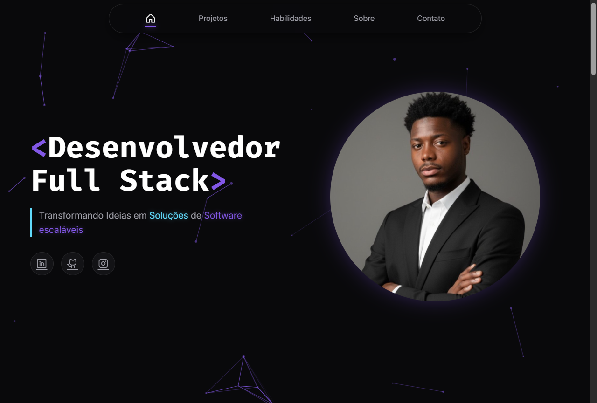

# 👨‍💻 Gelson Chissanda - Portfólio Pessoal

## 🌐 Demonstração Online
Acesse o projeto em tempo real: **[🔗 Visualizar Portfólio](https://portfolio-orpin-gamma-yuv25ys481.vercel.app)**

## 📌 Sobre o Projeto
Este é o meu portfólio pessoal desenvolvido para apresentar meus projetos, habilidades e trajetória como **Desenvolvedor Fullstack**. 

O objetivo foi criar uma interface moderna, responsiva e com identidade visual forte ("Dark Neon"), utilizando tecnologias nativas da web para demonstrar domínio dos fundamentos.

## 🚀 Tecnologias Utilizadas
* **HTML5** (Semântica e Estrutura)
* **CSS3** (Flexbox, Grid, Animações, Variáveis, Responsividade)
* **JavaScript** (Manipulação de DOM, Canvas API para partículas)
* **Bibliotecas:** [ScrollReveal](https://scrollrevealjs.org/), [Phosphor Icons](https://phosphoricons.com/)

## ✨ Funcionalidades
* 🌌 **Fundo Interativo:** Partículas conectadas desenhadas em HTML Canvas.
* 📱 **Design Responsivo:** Adaptável para Desktop, Tablets e Mobile.
* 🎨 **Animações:** Header inteligente, cards flutuantes e scroll reveal.
* 📋 **Funcionalidade de Cópia:** Botão para copiar e-mail para a área de transferência.

